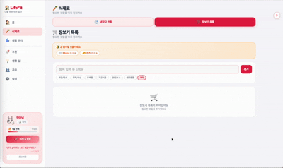
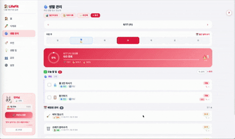
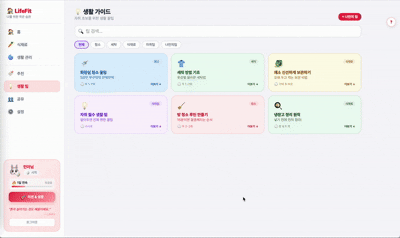
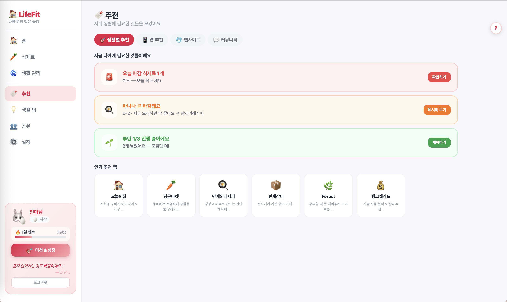
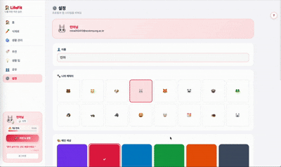

# 🏠 LifeFit — 자취 생활 관리 앱


- **배포 URL** : https://mylife-app-f8568.web.app
- **Test ID** : test@lifefit.com
- **Test PW** : 123456

<br>

## 프로젝트 소개

**LifeFit**은 혼자 사는 자취생을 위한 올인원 생활 관리 앱입니다.

- 냉장고 식재료의 유통기한을 색상으로 한눈에 파악하고, 임박 항목을 자동으로 알려줍니다.
- 빨래·청소·루틴을 주기별로 등록해두면 오늘 챙겨야 할 것들을 대시보드에서 바로 확인할 수 있습니다.
- 매일 루틴을 완료하면 스트릭(연속 달성)이 쌓이고, 주간 미션을 달성하며 캐릭터가 성장합니다.
- 룸메이트와 공유 코드로 연결해 생활 현황을 함께 관리할 수 있습니다.

<br>

## 개발 환경

- **Front-end** : React 18 (CDN UMD), Babel Standalone
- **Back-end / DB** : Firebase Authentication, Cloud Firestore
- **상태 관리** : React useState / useContext (ThemeCtx · DarkCtx · CustomSectionsCtx)
- **스타일** : CSS Variables 기반 라이트·다크 테마, Pretendard 폰트
- **배포** : Firebase Hosting

<br>

## 기술 스택

| 분류 | 기술 |
|---|---|
| Frontend | React 18, Babel Standalone, CSS Variables |
| Backend | Firebase Authentication, Cloud Firestore |
| 상태관리 | React Context API (useContext) |
| 배포 | Firebase Hosting |

<br>

## 프로젝트 구조

```
LifeFit/
├── index.html        # 전체 앱 (React + Firebase + 로직 통합)
├── firebase.js       # Firebase 초기화
├── style.css         # 글로벌 스타일
├── js/               # 분리된 JS 모듈
└── screenshots/      # README 이미지
```

**index.html 내부 논리 구조**

```
├── [CSS]      라이트/다크 CSS 변수 정의
├── [Firebase] SDK 초기화 및 래퍼 객체
└── [React]    앱 전체 컴포넌트
    ├── UTILS          날짜 계산, 상태 판단 유틸 함수
    ├── SHARED UI      Modal, Btn, CircleGauge, RepeatPicker
    ├── SIDEBAR        데스크탑 사이드바 + 모바일 드로어
    ├── HOME           홈 대시보드
    ├── FOOD           식재료 관리 + 장보기
    ├── LIFE           생활 관리 + 월간 달력
    ├── DIARY          하루 기록
    ├── REPORT         월간 리포트
    ├── MISSION        미션 & 성장
    ├── TIPS           생활 팁
    ├── SHARE          공유
    ├── HUB            추천
    ├── SETTINGS       설정
    └── AUTH / ONBOARDING  인증 + 최초 셋업
```

<br>

## 페이지별 기능

---

### [웰컴 & 로그인 / 회원가입]

서비스 최초 진입 시 웰컴 화면이 표시됩니다.

- 이메일/비밀번호 로그인 및 Google 소셜 로그인을 지원합니다.
- 회원가입 시 이메일 형식, 비밀번호 6자 미만 등 유효성 검사를 실시간으로 수행합니다.
- Firebase 에러 코드를 한국어 메시지로 변환해 사용자에게 안내합니다.
- 로그인 상태에 따라 온보딩 또는 홈 화면으로 자동 이동합니다.

| 웰컴 · 로그인 · 회원가입 |
|---|
|  |

<br>

---

### [온보딩 (최초 1회)]

로그인 후 최초 1회, 3단계 온보딩이 실행됩니다.

- **Step 1** : 메인 색상(6가지) + 캐릭터 이모지 선택
- **Step 2** : 자취 경력 선택 (방금 이사 / 1년 이상 / 오래됨) → 선택에 맞는 생활 관리 항목이 자동으로 추가됩니다.
- **Step 3** : 완료 후 Firestore에 `onboarded: true` 저장, 이후 진입 시 홈으로 바로 이동합니다.

| 온보딩 |
|---|
|  |

<br>

---

### [홈]

오늘 챙겨야 할 것들을 한눈에 보여주는 대시보드입니다.

- **오늘 챙길 것들** : 기간 초과 식재료, 밀린 생활 관리, 미완료 루틴을 우선순위 순으로 최대 3개 표시합니다. 모두 처리하면 🎉 완료 메시지가 나타납니다.
- **요약 카드 3종** : 오늘 달성률(원형 게이지) · 스트릭 일수 · 유통기한 임박 개수를 한눈에 표시합니다.
- **먼저 먹어야 해요** : D-5 이하 식재료를 초록→노랑→주황→빨강 색상으로 시각화합니다.
- **상황별 추천** : 현재 식재료·루틴 상태를 분석해 지금 필요한 것을 자동으로 제안합니다.
- **빠른 실행** : 식재료 추가 · 생활 관리 · 장보기 · 생활 팁으로 이동하는 버튼 4개
- **이번 주 달성 현황** : 요일별 달성률을 막대로 표시합니다. 🌱 1개↑ / 💪 50%↑ / 🔥 100%

| 홈 |
|---|
|  |

<br>

---

### [식재료]

냉장고 현황과 장보기 목록을 통합 관리합니다.

#### 냉장고 현황

- 이름·이모지·보관 방법(냉장/냉동/상온)·구매일·유통기한을 입력해 식재료를 추가합니다.
- **빠른 추가** : 자주 쓰는 식재료 버튼 탭 시 유통기한 선택 모달이 바로 열립니다.
- **카테고리별 추가** : 과일/채소/정육/유제품/가공식품/양념·소스/곡류 7카테고리, 50여 개 프리셋을 제공합니다.
- 색상 상태 : 초록(여유) → 노랑(D-7 이하) → 주황(D-3 이하) → 빨강(기한 초과)
- 보관 방법 필터 + 이름 검색, 수정·삭제 기능을 제공합니다.

#### 장보기 목록

- 항목 입력 후 Enter 또는 추가 버튼으로 등록하며 카테고리를 지정할 수 있습니다.
- 임박 식재료를 자동 감지해 탭 한 번으로 장보기 목록에 추가합니다.
- 항목 체크 시 완료 처리, 완료된 항목 일괄 삭제 기능을 제공합니다.

| 식재료 추가 | 장보기 목록 |
|---|---|
|  |  |

<br>

---

### [생활 관리]

루틴·생활·청소를 날짜별로 관리합니다.

- **섹션 구분** : 🌀 루틴 / 🏠 생활 / 🧹 청소로 나뉘어 표시됩니다.
- **완료 체크** : 항목 왼쪽 체크박스를 탭하면 `lastDone = 오늘`이 Firestore에 저장됩니다. 다시 탭하면 취소됩니다.
- **상태 배지** : 루틴은 오늘 요일 해당 여부를, 생활/청소는 D-day를 색상 배지로 표시합니다.
- **날짜 이동** : ‹ › 버튼으로 과거/미래 날짜를 탐색합니다.
- **순서 편집** : ⇅ 버튼으로 항목 순서를 변경할 수 있습니다.
- **✨ 추천팩** : 자취 경력에 맞는 항목 세트를 한 번에 추가합니다.
- **이번 주 요일 바** : 7일 달성 현황을 요일 버튼으로 표시하고, 탭하면 해당 날짜로 이동합니다.
- **월간 달력** : 📅 버튼으로 일별 달성 히트맵(🌱/💪/🔥)을 확인합니다.

| 생활 관리 체크 | 월간 달력 |
|---|---|
|  |  |

<br>

---

### [월간 리포트]

이번 달 생활 관리 통계를 한눈에 확인합니다.

- 활동한 날 수 · 평균 달성률 · 최장 연속 달성 · 완벽 달성 일 수를 요약합니다.
- 일별 달성 히트맵과 달성 분포(완벽/노력/시작/기록없음) 바 차트를 제공합니다.

<br>

---

### [하루 기록]

날짜별로 하루를 기록하는 간단한 다이어리입니다.

- 기분 이모지(10종)와 자유 텍스트로 하루를 기록합니다.
- Firestore에 저장되어 과거 기록을 목록에서 모두 열람·수정·삭제할 수 있습니다.

| 하루 기록 |
|---|
|  |

<br>

---

### [미션 & 성장]

주간 미션과 캐릭터 성장 시스템으로 생활 관리를 게임처럼 즐깁니다.

- **캐릭터 성장** : 스트릭이 쌓이면 🥚 시작 → 🌱 새싹 → ⭐ 노력가 → 💎 고수 → 👑 전설 순서로 성장합니다.
- **레벨 로드맵** : 5단계 성장 경로와 현재 달성 진행률을 시각화합니다.
- **주간 미션** : 달성일 수·완벽한 하루·청소 완료·식재료 폐기 0개 등 6가지 미션을 매주 월요일 초기화합니다.
- **주간 XP** : 미션 완료 시 XP가 누적되고 진행 바로 확인합니다.

| 미션 & 성장 |
|---|
|  |

<br>

---

### [생활 팁]

자취 생활에 필요한 팁을 카드 형식으로 제공합니다.

- 기본 팁 6종(화장실 청소·세탁·채소 보관·방 청소 루틴 등)을 제공합니다.
- 청소/세탁/식재료/자취팁/나만의팁 카테고리 필터 + 키워드 실시간 검색을 지원합니다.
- **나만의 팁** : 이모지·제목·카테고리·내용을 직접 입력해 추가하며 localStorage에 저장됩니다.
- 카드 탭 시 상세 내용이 인라인으로 펼쳐집니다.

| 생활 팁 |
|---|
|  |

<br>

---

### [추천]

현재 상황에 맞는 앱·사이트·커뮤니티를 추천합니다.

- **상황별 추천** : 기간 초과 식재료, 밀린 청소, 루틴 미완료 등 현재 상태를 분석해 자동으로 제안합니다.
- **앱 추천** : 오늘의집·당근마켓·만개의레시피 등 자취 생활 유용 앱 10종을 카테고리별로 정리했습니다.
- **웹사이트** : 분리배출·식품안전나라·전기요금 계산기·기상청 등 실용 사이트 6개를 제공합니다.
- **커뮤니티** : 자취 생활 정보 공유 커뮤니티 링크 4개를 포함합니다.

| 추천 |
|---|
|  |

<br>

---

### [공유]

룸메이트와 생활 관리를 함께합니다.

- 6자리 랜덤 공유 코드를 생성하고 클립보드로 복사합니다.
- 룸메이트의 코드를 입력해 연결 요청을 보냅니다.
- 오늘 달성 개수·등록 식재료 수·생활 관리 항목 수를 미리보기로 표시합니다.

<br>

---

### [설정]

프로필과 앱 스타일을 커스터마이징합니다.

- **이름 변경** : 닉네임 수정 시 Firebase Auth `displayName`도 함께 업데이트됩니다.
- **캐릭터 선택** : 🐻🐱🐶 등 16종 이모지 중 선택합니다.
- **메인 색상** : 보라·로즈·하늘·연두·오렌지·슬레이트 6가지 테마를 선택합니다.
- **다크모드** : 토글 한 번으로 CSS 변수 교체 방식으로 전체 색상이 전환됩니다.
- **섹션 색상 커스텀** : 루틴·생활·청소 섹션의 색상을 각각 선택할 수 있습니다.

| 설정 & 다크모드 |
|---|
|  |

<br>

## 트러블 슈팅

**Firestore id 충돌 문제**

- **문제** : `addDoc` 시 클라이언트에서 생성한 `id` 필드와 Firestore 자동 생성 `d.id`가 중복되어 삭제·수정 시 id 불일치가 발생했습니다.
- **해결** : `onSnapshot` 핸들러에서 `{...d.data(), id: d.id}` 순서로 병합해 Firestore `d.id`가 항상 우선 적용되도록 수정했습니다.

**완료 취소 시 lastDone 복원 문제**

- **문제** : 완료 취소 시 `lastDone = null`로 설정하면 생활/청소 항목의 주기 진행 바가 초기화되는 문제가 있었습니다.
- **해결** : 완료 취소 시 `lastDone = 어제 날짜`로 설정해 주기 계산을 유지하면서 오늘 완료 상태만 해제되도록 처리했습니다.

<br>

## 개선 목표

- **PWA 전환** : `manifest.json`과 Service Worker를 추가해 홈 화면 설치 및 오프라인 지원 예정
- **푸시 알림** : Firebase Cloud Messaging으로 유통기한 임박 및 루틴 리마인더 알림 구현 예정
- **통계 고도화** : 카테고리별 식재료 낭비율, 가장 많이 완료한 루틴 통계 추가 예정
- **공유 기능 완성** : 베타 상태인 룸메이트 공유 기능을 실시간 상대방 현황 조회까지 확장 예정
