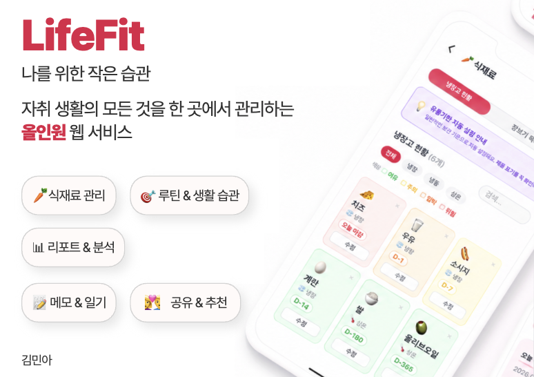

# 🏠 LifeFit — 자취 생활 관리 앱




- **배포 URL** : [https://mylife-app-f8568.web.app](https://m2n4.github.io/LifeFit/)
- **저장소** : https://github.com/m2n4/LifeFit


<br>

## 프로젝트 소개

**LifeFit**은 혼자 사는 자취생을 위한 올인원 생활 관리 앱입니다.

- 냉장고 속 식재료의 유통기한을 한눈에 확인하고 임박 항목을 자동으로 알려줍니다.
- 빨래·청소·루틴을 주기별로 등록해두면 "할 때가 됐어요" 알림이 표시됩니다.
- 매일 루틴을 완료하면 스트릭(연속 달성)이 쌓이며 캐릭터가 성장합니다.
- 룸메이트와 공유 코드로 연결해 서로의 생활 현황을 나란히 확인할 수 있습니다.

<br>

## 1. 개발 환경

- **Front-end**: React 18 (CDN UMD), Babel Standalone, CSS Variables (다크모드 지원)
- **Back-end/DB**: Firebase Authentication, Cloud Firestore
- **상태 관리**: React useState / useContext (ThemeCtx, DarkCtx, CustomSectionsCtx)
- **데이터 저장**: Cloud Firestore (실시간 동기화), localStorage (생활 팁 · 빠른 추가 커스텀)
- **배포**: Firebase Hosting / Netlify
- **디자인**: Pretendard 폰트, CSS Variables 기반 라이트·다크 테마

<br>

## 2. 채택한 개발 기술과 이유

### React (CDN 방식)
- 컴포넌트 단위로 UI를 분리해 유지보수와 재사용성을 높였습니다.
- `Sidebar`, `Modal`, `Btn`, `CircleGauge` 등 공통 컴포넌트를 만들어 코드 중복을 줄였습니다.
- Context API(`ThemeCtx`, `DarkCtx`, `CustomSectionsCtx`)로 전역 상태를 관리해 props drilling을 방지했습니다.

### Firebase
- **Authentication**: 이메일/비밀번호 + 구글 로그인을 지원합니다.
- **Firestore**: 식재료·생활관리 항목을 실시간 `onSnapshot`으로 동기화합니다. 여러 기기에서 동일한 데이터를 즉시 확인할 수 있습니다.
- **Firestore 구조**: `users/{uid}/foods`, `users/{uid}/lifeItems`, `users/{uid}/shoppingItems`, `users/{uid}/diaries`

### CSS Variables + 다크모드
- `:root`와 `body.dark`에 CSS 변수를 선언해 JS 없이 다크모드를 전환합니다.
- 6가지 메인 테마 색상을 Context로 전달하여 앱 전체 색상을 일관성 있게 관리했습니다.

<br>

## 3. 프로젝트 구조

```
lifefit/
├── index.html          # 전체 앱 (Firebase SDK + React + 앱 로직 통합)
└── README.md
```

**index.html 내부 구조 (논리적 섹션 분리)**

```
index.html
├── [CSS] 라이트/다크 CSS 변수 정의
├── [Firebase] SDK 초기화 및 _firebase 래퍼 객체
├── [React/Babel] 앱 전체 컴포넌트
│   ├── UTILS         calcDaysLeft, getFoodStatus, isTodayItem, isDoneOn, ...
│   ├── DATA PRESETS  FOOD_PRESETS, QUICK_FOOD, ONBOARDING_PRESETS, LIFE_GUIDES
│   ├── SHARED UI     Modal, Btn, CircleGauge, RepeatPicker
│   ├── SIDEBAR       Sidebar (데스크탑 + 모바일 드로어)
│   ├── HOME          HomePage, QuickActionBtn, PageHelp
│   ├── FOOD          FoodPage, ShoppingPage, DateModal, FoodFormFields
│   ├── LIFE          LifePage, LifeItemCard, ScheduledItemCard, MonthlyCalendar
│   ├── REPORT        ReportPage
│   ├── DIARY         DiaryPage
│   ├── TIPS          TipsPage
│   ├── MISSION       MissionPage, WEEKLY_MISSIONS, getCharacterGrowth
│   ├── SHARE         SharePage
│   ├── HUB           HubPage, getSituationalRecs, HUB_APPS, HUB_SITES
│   ├── SETTINGS      SettingsPage
│   ├── AUTH          WelcomeScreen, AuthScreen
│   ├── ONBOARDING    Onboarding (3단계 셋업)
│   └── APP ROOT      App (Firebase 통합, 라우팅, CRUD)
```

<br>

## 4. 개발 기간 및 작업 관리

- **전체 개발 기간**: 2025-05-XX ~ 2025-06-XX
- **기획 및 설계**: 화면 구조 기획, 데이터 모델 설계
- **기능 구현**: Firebase 연동, 페이지별 CRUD, 반응형 대응
- **테스트 및 배포**: 모바일 실기기 테스트, Firebase Hosting 배포

**작업 관리**: GitHub를 통한 커밋 이력 관리, 기능 단위 커밋 메시지 작성

<br>

## 5. 신경 쓴 부분

- **날짜 기반 완료 판단**: `done` boolean 대신 `lastDone` 날짜 문자열로 완료 여부를 판단해 날짜 이동(과거/미래) 시에도 정확한 상태를 표시합니다.
- **반응형 레이아웃**: 768px 기준으로 데스크탑(사이드바)과 모바일(상단 바 + 하단 탭 바)을 완전히 분리 구현했습니다.
- **Firestore id 충돌 방지**: `addDoc` 후 Firestore가 생성한 `d.id`를 항상 우선 적용해 클라이언트 임시 id와의 충돌을 방지했습니다.

<br>

## 6. 페이지별 기능

---

### [초기화면 / 로그인]

서비스 최초 진입 시 웰컴 화면이 표시됩니다.

- 로그인 상태가 아닌 경우: 웰컴 화면 → 회원가입 또는 로그인
- 로그인 상태인 경우: 온보딩 완료 여부에 따라 온보딩 또는 홈 화면으로 이동
- 이메일/비밀번호 로그인과 Google 소셜 로그인을 지원합니다.
- 입력값 유효성 오류(이메일 형식, 비밀번호 6자 미만 등)는 Firebase 에러 코드를 한국어로 변환해 표시합니다.

| 웰컴 & 로그인 |
|---|
| *(스크린샷 삽입: 웰컴 화면 → 로그인 화면 전환 GIF)* |

---

### [온보딩 (최초 1회)]

로그인 후 최초 1회, 3단계 온보딩이 실행됩니다.

- **Step 1**: 메인 색상(6가지) + 캐릭터 이모지 선택
- **Step 2**: 자취 경력 선택 (방금 이사 / 1년 이상 / 오래됨) → 선택에 맞는 생활 관리 항목이 자동으로 추가됩니다.
- 완료 후 Firestore의 `onboarded: true` 필드가 설정되어 이후에는 바로 홈으로 진입합니다.

| 온보딩 |
|---|
| *(스크린샷 삽입: 3단계 온보딩 GIF)* |

---

### [홈]

오늘 챙겨야 할 것들을 한눈에 보여주는 대시보드입니다.

- **시간대별 인사말**: 새벽/아침/오후/저녁에 따라 다른 메시지가 표시됩니다.
- **오늘 챙길 것들 (알림 카드)**: 기간 초과 식재료, 오늘 마감 식재료, 밀린 생활 관리 항목, 미완료 루틴을 우선순위 순서로 최대 3개 표시합니다. 모두 처리하면 🎉 완료 메시지가 나타납니다.
- **생활 달성 / 연속 달성 / 유통 임박**: 오늘 달성률(원형 게이지), 스트릭 일수, 유통기한 임박 개수를 카드 3개로 요약합니다.
- **먼저 먹어야 해요**: D-5 이하 식재료를 색상 상태(초록→노랑→주황→빨강)와 함께 리스트로 보여줍니다.
- **상황별 추천**: 현재 식재료·루틴 상태를 분석해 지금 필요한 것을 자동 추천합니다.
- **빠른 실행**: 식재료 추가, 생활 관리, 장보기, 생활 팁으로 이동하는 버튼 4개
- **이번 주 달성 현황**: 요일별 달성률을 막대로 표시합니다. 🌱 1개↑ / 💪 50%↑ / 🔥 100%

| 홈 화면 |
|---|
| *(스크린샷 삽입: 홈 대시보드 전체 스크롤 GIF)* |

---

### [식재료]

냉장고 현황과 장보기 목록을 관리합니다.

#### 냉장고 현황 탭

- **+ 추가**: 이름, 이모지, 보관 방법(냉장/냉동/상온), 구매일, 유통기한을 직접 입력해 추가합니다.
- **빠른 추가**: 자주 쓰는 식재료 버튼을 탭하면 유통기한 선택 모달이 바로 열립니다. 편집 모드에서 커스텀도 가능합니다.
- **카테고리별 추가**: 과일/채소/정육/유제품/가공식품/양념·소스/곡류 총 7카테고리, 50여 개 프리셋을 제공합니다.
- **색상 상태**: 초록(여유) → 노랑(주의, D-7이하) → 주황(임박, D-3이하) → 빨강(위험/초과)으로 시각화합니다.
- **보관 방법 필터 + 검색**: 냉장/냉동/상온으로 필터링하고 이름으로 검색합니다.
- **수정 / 삭제**: 카드의 수정 버튼으로 내용을 변경하고 ✕ 버튼으로 삭제합니다.

#### 장보기 목록 탭

- 항목 입력 후 Enter 또는 추가 버튼으로 등록합니다. 카테고리를 지정할 수 있습니다.
- 임박 식재료를 자동으로 감지해 "곧 떨어질 것들이에요" 배너에서 탭 한 번으로 추가합니다.
- 항목 체크 시 완료 처리, 완료된 항목 일괄 삭제 기능을 제공합니다.
- Firestore 실시간 동기화로 여러 기기에서 같은 목록을 공유합니다.

| 식재료 추가 | 장보기 목록 |
|---|---|
| *(스크린샷 삽입: 식재료 추가 GIF)* | *(스크린샷 삽입: 장보기 체크 GIF)* |

---

### [생활 관리]

루틴·생활·청소를 날짜별로 관리합니다.

#### 오늘 할 일

- **섹션 구분**: 🌀 루틴(매일/요일/주기 반복) / 🏠 생활(빨래 등 N일 주기) / 🧹 청소(화장실 등 N일 주기)로 나뉩니다.
- **완료 체크**: 항목 왼쪽 체크박스를 탭하면 완료(`lastDone = 오늘`)가 저장됩니다. 다시 탭하면 취소됩니다.
- **상태 배지**: 루틴은 오늘 요일 해당 여부를, 생활/청소는 D-day(주기 대비 경과일)를 색상 배지로 표시합니다.
- **날짜 이동**: ‹ › 버튼으로 과거/미래 날짜를 탐색합니다. 과거는 읽기 전용으로, 미래는 구성 미리보기로 표시됩니다.
- **순서 편집**: 미완료 항목이 2개 이상이면 ⇅ 버튼이 활성화되고, ↑↓으로 순서를 바꿀 수 있습니다.
- **✨ 추천팩**: 자취 경력(방금 이사/1년 이상/오래됨)에 맞는 항목 세트를 한 번에 추가합니다.
- **예정된 관리**: 아직 주기가 되지 않은 항목을 별도 섹션에 접기/펼치기로 표시합니다.

#### 이번 주 요일 바 / 월간 달력

- 이번 주 7일의 달성 현황을 요일 버튼으로 표시하고, 탭하면 해당 날짜로 이동합니다.
- 📅 버튼을 누르면 월간 달력이 펼쳐지며 일별 달성 상태(🌱/💪/🔥)를 히트맵으로 보여줍니다.

#### 월간 리포트 탭

- 활동한 날 수, 평균 달성률, 이번 달 최장 연속, 완벽 달성 일 수를 요약합니다.
- 일별 달성 히트맵과 달성 분포(완벽/노력/시작/기록없음) 바 차트를 제공합니다.

#### 하루 기록 탭 (일기)

- 날짜를 선택하고 기분 이모지(10종)와 자유 텍스트로 하루를 기록합니다.
- Firestore에 저장되어 목록 탭에서 과거 기록을 모두 열람·수정·삭제할 수 있습니다.

| 생활 관리 | 날짜 이동 | 월간 달력 |
|---|---|---|
| *(스크린샷 삽입: 항목 체크 GIF)* | *(스크린샷 삽입: 날짜 이동 GIF)* | *(스크린샷 삽입: 월간 달력)* |

---

### [미션 & 성장]

캐릭터 성장과 주간 미션을 통해 생활 관리를 게임처럼 즐깁니다.

- **캐릭터 성장**: 스트릭(연속 달성)이 쌓이면 🥚 시작 → 🌱 새싹 → ⭐ 노력가 → 💎 고수 → 👑 전설 순서로 성장합니다.
- **레벨 로드맵**: 5단계 성장 경로를 시각화하고 현재 레벨의 달성 진행률을 표시합니다.
- **주간 미션**: 이번 주 달성일 수, 완벽한 하루, 청소 완료, 식재료 폐기 0개, 하루기록 작성 등 6가지 미션을 매주 월요일에 초기화합니다.
- **주간 XP**: 미션 완료 시 XP가 누적되고 진행 바로 한눈에 확인합니다.

| 미션 & 성장 |
|---|
| *(스크린샷 삽입: 미션 페이지 스크롤 GIF)* |

---

### [생활 팁]

자취 생활에 필요한 팁을 카드 형식으로 제공합니다.

- **기본 팁 6종**: 화장실 청소, 세탁, 채소 보관, 자취 필수 팁, 방 청소 루틴, 냉장고 정리 원칙
- **카테고리 필터**: 청소/세탁/식재료/자취팁/나만의팁으로 필터링합니다.
- **검색**: 제목·내용·카테고리 키워드로 실시간 검색합니다.
- **나만의 팁**: + 버튼으로 이모지·제목·카테고리·내용을 직접 입력해 추가하며 localStorage에 저장됩니다. 수정·삭제도 가능합니다.
- **카드 펼치기**: 카드 탭 시 상세 내용이 인라인으로 펼쳐집니다.

| 생활 팁 | 나만의 팁 추가 |
|---|---|
| *(스크린샷 삽입: 팁 카드 목록)* | *(스크린샷 삽입: 나만의 팁 추가 GIF)* |

---

### [추천]

상황에 맞는 앱·사이트·커뮤니티를 추천합니다.

- **상황별 추천**: 기간 초과 식재료, 밀린 청소, 늦은 시간 루틴 미완료 등 현재 상태를 분석해 지금 필요한 것을 자동으로 제안합니다.
- **앱 추천**: 오늘의집, 당근마켓, 만개의레시피 등 자취 생활에 유용한 앱 10종을 카테고리별로 정리했습니다.
- **웹사이트**: 분리배출 정보, 식품안전나라, 전기요금 계산기, 기상청 날씨 등 실용 사이트 6개를 제공합니다.
- **커뮤니티**: 자취 생활 정보 공유 커뮤니티 링크 4개를 포함합니다.

| 추천 탭 |
|---|
| *(스크린샷 삽입: 추천 페이지 GIF)* |

---

### [공유]

룸메이트와 생활 관리를 함께합니다.

- **공유 코드 생성**: 6자리 랜덤 코드를 생성하고 클립보드로 복사합니다.
- **코드 연결**: 룸메이트의 코드를 입력해 연결 요청을 보냅니다.
- **현황 미리보기**: 오늘 달성 개수, 등록 식재료 수, 생활 관리 항목 수를 표시합니다.

| 공유 |
|---|
| *(스크린샷 삽입: 공유 페이지 스크린샷)* |

---

### [설정]

프로필과 앱 스타일을 커스터마이징합니다.

- **이름 변경**: 닉네임을 수정하면 Firebase Auth `displayName`도 함께 업데이트됩니다.
- **캐릭터 선택**: 🐻🐱🐶 등 16종 이모지 중 선택합니다. 사이드바에 즉시 반영됩니다.
- **메인 색상**: 보라/로즈/하늘/연두/오렌지/슬레이트 6가지 테마를 선택합니다.
- **다크모드**: 토글 한 번으로 어두운 화면으로 전환합니다. CSS 변수 교체 방식으로 전체 색상이 바뀝니다.
- **섹션 색상 커스텀**: 루틴·생활·청소 섹션의 색상을 각각 6가지 중에서 선택합니다.

| 설정 |
|---|
| *(스크린샷 삽입: 설정 화면 + 다크모드 전환 GIF)* |

<br>

## 7. 트러블 슈팅

**Firestore id 충돌 문제**

- **문제**: `addDoc` 시 클라이언트에서 생성한 `id` 필드와 Firestore가 자동 생성하는 `d.id`가 중복되어 삭제·수정 시 id 불일치가 발생했습니다.
- **해결**: `onSnapshot` 핸들러에서 `{...d.data(), id: d.id}` 순서로 병합해 Firestore `d.id`가 항상 우선 적용되도록 수정했습니다.

**완료 취소 시 lastDone 복원 문제**

- **문제**: 완료 취소 시 `lastDone = null`로 설정하면 생활/청소 항목의 주기 진행 바가 초기화되는 문제가 있었습니다.
- **해결**: 완료 취소 시 `lastDone = 어제 날짜`로 설정해 주기 계산은 유지하면서 오늘 완료 상태만 해제되도록 처리했습니다.

<br>

## 8. AI 활용 내역

본 프로젝트는 AI 도구를 적극 활용하여 개발했습니다.

| 도구 | 활용 내용 |
|---|---|
| **Claude** | 컴포넌트 구조 설계 초안, Firestore CRUD 코드 생성, CSS Variables 다크모드 구조 제안, 반복 유틸 함수(isTodayItem, isDueOn 등) 초안 |
| **ChatGPT** | Firebase compat SDK 래퍼 오류 분석, 날짜 계산 엣지케이스 디버깅, README 구조 검토 |

**직접 수행한 작업**

- 전체 기능 기획 및 화면 설계 (어떤 데이터를 어떻게 보여줄지 결정)
- AI 생성 코드의 로직 검토 및 수정 (특히 날짜 기반 완료 판단 로직을 전면 재설계)
- Firebase Firestore 컬렉션 구조 설계 및 직접 설정
- Firestore id 충돌 버그 발견 및 수정
- 모바일 실기기 테스트 및 반응형 레이아웃 직접 조정
- 배포 환경 설정 및 테스트

> AI가 생성한 코드는 그대로 사용하지 않고 반드시 로직을 이해한 후 수정·적용했습니다.
> 특히 `lastDone` 기반 완료 판단 방식은 AI 초안의 `done: boolean` 방식이 날짜 이동 기능과 충돌함을 발견하고 직접 재설계했습니다.

<br>

## 9. 개선 목표

- **PWA 전환**: `manifest.json`과 Service Worker를 추가해 홈 화면 설치 및 오프라인 지원 예정
- **푸시 알림**: Firebase Cloud Messaging으로 유통기한 임박 및 루틴 리마인더 알림 구현 예정
- **통계 고도화**: 월간 리포트에 카테고리별 식재료 낭비율, 가장 많이 완료한 루틴 통계 추가 예정
- **공유 기능 완성**: 현재 베타 상태인 룸메이트 공유 기능을 실시간 상대방 현황 조회까지 확장 예정
