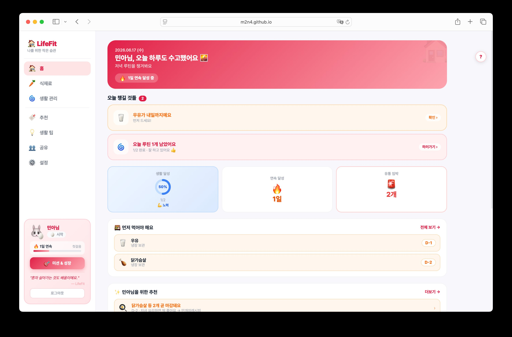
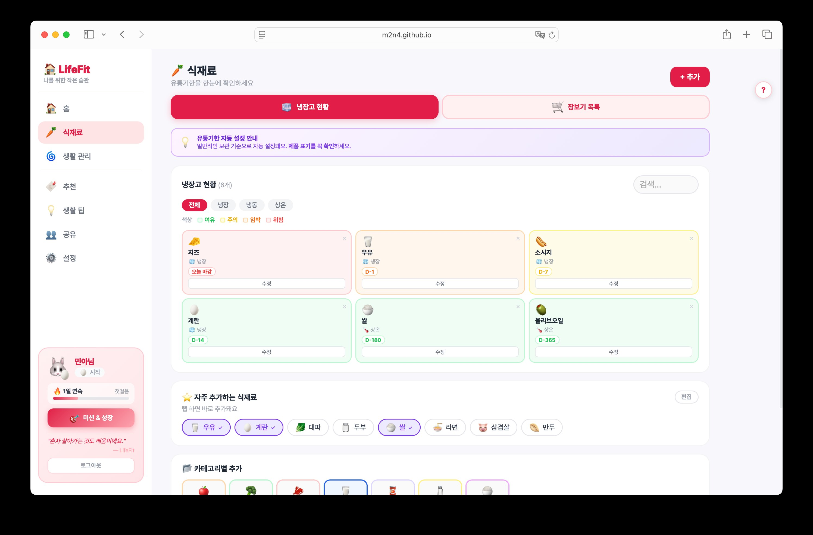
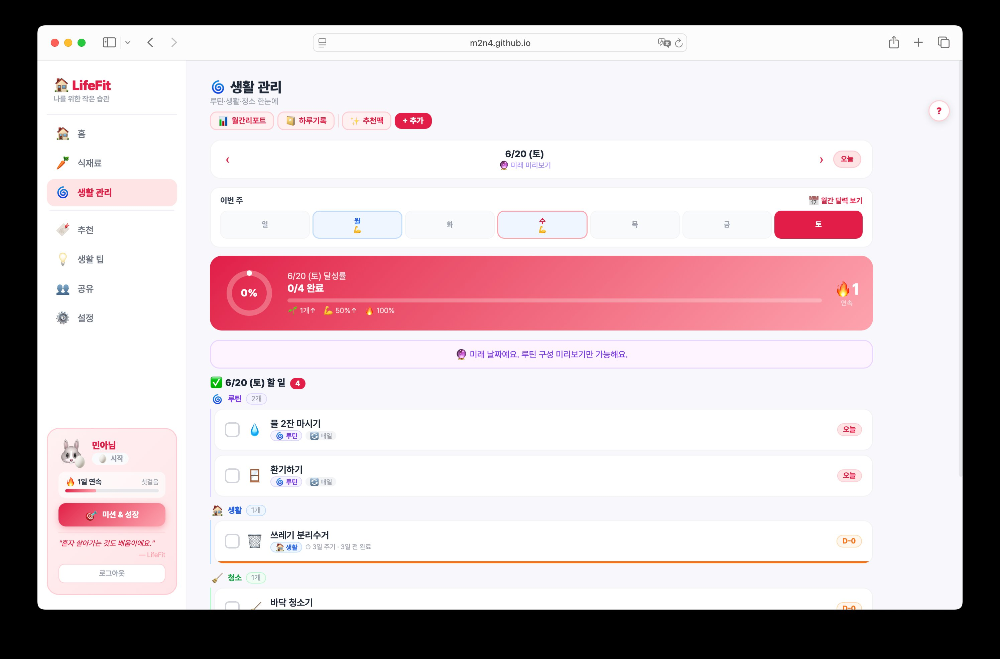
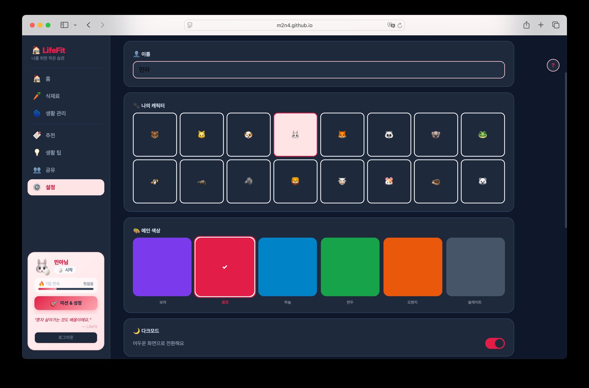

# 🏠LifeFit — 자취 생활 관리 웹 


> **웹시스템설계 기말 프로젝트**
> 제출일: 2026년 06월 18일
> 개발 언어: HTML · CSS · JavaScript (React) | 백엔드: Firebase
> 배포 주소: https://m2n4.github.io/LifeFit/
> 저장소: https://github.com/m2n4/LifeFit

---

## 목차

1. [프로젝트 소개](#1-프로젝트-소개)
2. [주요 기능 및 화면](#2-주요-기능-및-화면)
3. [기술 스택](#3-기술-스택)
4. [프로젝트 구조](#4-프로젝트-구조)
5. [실행 방법](#5-실행-방법)
6. [구현 중 어려웠던 점](#6-구현-중-어려웠던-점)
7. [AI 활용 내역](#7-ai-활용-내역)
8. [프로젝트 성과 및 회고](#8-프로젝트-성과-및-회고)
9. [참고 자료](#9-참고-자료)

---

## 1. 프로젝트 소개

자취 생활을 하면서 식재료 유통기한을 자주 까먹거나, 청소 주기를 놓치는 경험을 했다. 이런 것들을 따로따로 앱을 써서 관리하기가 번거로워서, 한 곳에서 전부 관리할 수 있는 웹 앱을 직접 만들어보기로 했다.

Firebase로 로그인 기능과 데이터 저장을 구현해서, 로그인하면 어느 기기에서든 같은 데이터를 볼 수 있다.

**주요 기능 목록**
- 식재료 유통기한 관리 (D-day 색상 표시)
- 생활 루틴 / 청소 / 생활 관리 체크리스트
- 장보기 목록
- 연속 달성(스트릭) + 캐릭터 성장
- 메모·일기, 월간 리포트
- 설정 (테마, 다크모드 등)

---

## 2. 주요 기능 및 화면

### 2-1. 홈 화면

오늘 할 일, 유통기한 임박 식재료, 이번 주 달성 현황을 한눈에 볼 수 있다.



---

### 2-2. 식재료 유통기한 관리

식재료를 등록하면 남은 일수에 따라 카드 색상이 바뀐다.

| 색상 | 기준 | 의미 |
|:---:|:---:|:---|
| 🟢 녹색 | D-8 이상 | 여유 있음 |
| 🟡 노랑 | D-4 ~ D-7 | 슬슬 먹어야 함 |
| 🟠 주황 | D-1 ~ D-3 | 곧 만료 |
| 🔴 빨강 | D-0 또는 초과 | 지남 / 오늘 마감 |

카테고리별 프리셋(과일, 채소, 정육 등)에서 탭 한 번으로 빠르게 추가할 수도 있다.



---

### 2-3. 생활 관리 체크리스트

루틴(매일 하는 것), 생활(빨래, 분리수거 등), 청소(화장실, 배수구 등) 세 가지 섹션으로 나뉜다.

- 체크하면 오늘 완료 처리, 다음 날 자동으로 초기화됨
- 반복 주기 설정 가능 (매일, 평일, N일마다 등)
- `< >` 버튼으로 날짜를 바꿔서 과거 기록을 볼 수 있음



---

### 2-4. 연속 달성(스트릭) + 캐릭터 성장

루틴을 하루 1개 이상 완료하면 스트릭이 1 늘어난다. 일수가 쌓일수록 사이드바의 캐릭터가 성장한다.

| 단계 | 조건 | 뱃지 |
|:---:|:---:|:---:|
| 시작 | 첫걸음 | 🥚 |
| 새싹 | 3일 이상 | 🌱 |
| 노력가 | 7일 이상 | ⭐ |
| 고수 | 14일 이상 | 💎 |
| 전설 | 30일 이상 | 👑 |

---

### 2-5. 그 외 기능

- **장보기 목록:** 필요한 것 추가하고 마트에서 하나씩 체크
- **메모·일기:** 날짜별로 간단한 메모나 일기 저장
- **월간 리포트:** 이번 달 달성률, 스트릭 현황 확인
- **설정:** 테마 컬러 6가지, 다크모드, 캐릭터 이모지 변경 가능



---

## 3. 기술 스택

| 분야 | 사용 기술 | 이유 |
|:---|:---|:---|
| 마크업 | HTML5 | 기본 구조 |
| 스타일 | CSS3 | 전체 스타일, 다크모드, 반응형 |
| UI | React 18 (CDN) | 화면 구성과 상태 관리 |
| 트랜스파일러 | Babel Standalone | 빌드 도구 없이 JSX 사용하려고 |
| 데이터베이스 | Firebase Firestore | 로그인 후 데이터 저장 |
| 인증 | Firebase Authentication | 이메일 / 구글 로그인 |
| 폰트 | Pretendard | 한국어 폰트 |
| 버전 관리 | Git / GitHub | 코드 관리 및 배포 |
| 배포 | GitHub Pages | 무료로 배포 가능 |

---

## 4. 프로젝트 구조

처음에는 `index.html` 파일 하나에 모든 코드를 작성했는데, 코드가 너무 길어져서 기능별로 파일을 나눴다.

```
LifeFit/
├── index.html        # 시작 파일, 스크립트 불러오는 순서 정의
├── style.css         # 전체 스타일 (다크모드, 반응형 포함)
├── firebase.js       # Firebase 초기화
└── js/
    ├── App.js        # 로그인 상태 관리, 전체 레이아웃
    ├── utils/        # 날짜 계산, 반복 주기 판단 등 공통 함수 (3개)
    ├── components/   # 여러 페이지에서 같이 쓰는 UI (사이드바, 로그인 화면 등, 3개)
    └── pages/        # 각 탭별 화면 (홈, 식재료, 생활관리 등 12개)
```

파일이 많아지면서 불러오는 순서가 중요해졌다. `index.html`에서 utils → components → pages → App.js 순서로 불러온다.

Git을 활용하여 기능 추가, 버그 수정, 리팩토링 과정을 단계적으로 관리하였다. 최종 결과물은 GitHub 저장소를 통해 버전 이력을 확인할 수 있다.

---

## 5. 실행 방법

### 배포 버전 바로 보기

👉 https://m2n4.github.io/LifeFit/

### 로컬에서 직접 실행하기

> ⚠️ `index.html`을 그냥 더블클릭하면 화면이 안 나온다. 아래 방법 중 하나로 실행해야 한다.

**VS Code Live Server 사용 (추천)**
1. VS Code에서 `Live Server` 확장 설치
2. `index.html` 우클릭 → "Open with Live Server"

**Python 서버 사용**
```bash
python3 -m http.server 8080
# 브라우저에서 http://localhost:8080 열기
```

### Firebase 직접 설정할 경우

`firebase.js` 파일의 `firebaseConfig` 값을 본인 Firebase 프로젝트 설정으로 바꾸면 된다.

```javascript
const firebaseConfig = {
  apiKey: "...",
  authDomain: "...",
  projectId: "...",
  // 나머지도 동일하게
};
```

---

## 6. 구현 중 어려웠던 점

### ① Firebase 사용법이 버전마다 달랐던 문제

| | 내용 |
|:---|:---|
| **문제** | 공식 문서 예제를 그대로 붙여넣었는데 오류가 남 |
| **원인** | CDN으로 불러온 Firebase는 예전 방식이고, 공식 문서는 최신 방식으로 쓰여 있어서 문법이 달랐음 |
| **해결** | CDN 방식에 맞게 코드를 직접 수정해서 동작하도록 고침 |

---

### ② 날짜가 바뀌어도 체크가 초기화 안 되는 문제

| | 내용 |
|:---|:---|
| **문제** | 루틴을 체크하고 다음 날이 되어도 체크가 그대로 남아 있음 |
| **원인** | 완료 여부를 `true/false`로만 저장해서 언제 했는지 날짜 정보가 없었음 |
| **해결** | 완료 날짜를 `'2026-06-18'` 같은 문자열로 저장하고, 오늘 날짜랑 비교하는 방식으로 바꿈 |

---

### ③ 데스크탑이랑 모바일 레이아웃이 겹쳐 보이는 문제

| | 내용 |
|:---|:---|
| **문제** | 데스크탑에선 사이드바, 모바일에선 하단 탭바로 보여야 하는데 둘이 겹쳐서 이상하게 나옴 |
| **원인** | 단순히 숨기기만 하면 레이아웃 공간이 여전히 남아 있어서 충돌함 |
| **해결** | CSS 미디어 쿼리로 화면 너비 768px 기준에 따라 다른 구조가 보이도록 분리 |

---

### ④ 파일 나눴더니 갑자기 안 열리는 문제

| | 내용 |
|:---|:---|
| **문제** | 파일을 여러 개로 분리한 후 더블클릭으로 열면 화면이 빈 채로 나옴 |
| **원인** | 브라우저가 `file://` 방식으로는 다른 파일을 불러오는 걸 막음 (보안 정책) |
| **해결** | VS Code의 Live Server로 실행하면 해결됨 |

---

### ⑤ 체크박스를 빠르게 누르면 스트릭이 여러 번 올라가는 버그

| | 내용 |
|:---|:---|
| **문제** | 체크를 빠르게 여러 번 눌렀을 때 스트릭이 2, 3씩 올라가는 버그 |
| **원인** | 체크할 때마다 스트릭 업데이트 함수가 매번 실행됨 |
| **해결** | 오늘 이미 스트릭이 기록됐으면 더 이상 실행하지 않도록 조건 추가 |

---

## 7. AI 활용 내역

개발 과정에서 Claude와 ChatGPT를 참고용으로 활용하였다.

| AI 도구 | 활용한 내용 |
|:---|:---|
| Claude | JSX 코드 예시, 리팩토링 방향 아이디어 참고 |
| Claude | Firebase 사용법 관련 코드 예시 참고 |
| Claude | 오류 발생 시 원인 파악 참고 |
| ChatGPT | Firebase 보안 규칙 예시 참고 |
| ChatGPT | GitHub Pages 배포 방법 참고 |

AI를 활용하여 코드 예시와 오류 해결 방향을 참고하였다. 실제 기능 구현과 통합, 테스트 및 수정은 직접 수행하였다. AI가 제안한 코드를 그대로 붙여넣은 게 아니라, 실제로 동작하는지 확인하고 내 프로젝트에 맞게 수정하면서 적용하였다. Firebase 설정, 배포, 버그 수정 등은 직접 진행하였다.

---

## 8. 프로젝트 성과 및 회고

### 구현 결과

| 항목 | 내용 |
|:---|:---|
| 구현 화면 | 총 12개 (홈, 식재료, 장보기, 생활관리, 생활팁, 리포트, 일기, 미션, 공유, 추천, 설정, 온보딩) |
| Firebase 인증 | 이메일 로그인 + Google 로그인 구현 |
| 데이터 저장 | Firestore로 식재료, 생활관리 항목, 일기 저장 및 CRUD |
| 반응형 | 데스크탑(사이드바) / 모바일(하단 탭바) 분리 대응 |
| 다크모드 | 토글로 전환 가능 |
| 배포 | GitHub Pages로 배포 완료 |
| 리팩토링 | 단일 파일 중심 구조를 역할별 22개 파일 구조로 분리 |

### 회고

처음에는 `index.html` 파일 하나에 코드를 전부 다 썼다. 그러다 보니 수정할 때 어디가 어딘지 찾기가 너무 힘들었다. 파일을 기능별로 나눠봤더니 확실히 찾기 편해졌다.

Firebase는 처음 써봐서 오류가 꽤 많이 났다. 공식 문서 예제랑 CDN 방식이 다르다는 걸 한참 지나서야 알았다. 구글링이랑 AI 참고를 많이 했는데, 결국 직접 테스트해보면서 고치는 게 제일 확실했다.

반응형 레이아웃도 처음엔 데스크탑이랑 모바일이 겹쳐서 이상하게 나왔는데, CSS 미디어 쿼리로 아예 다른 구조를 보여주는 방식으로 해결했다.

GitHub Pages로 실제 배포까지 해보니까 뭔가 진짜 서비스 같은 느낌이라 뿌듯했다. 배포하고 나서도 오류가 있어서 몇 번 더 수정했다.

---

## 9. 참고 자료

| 자료 | URL |
|:---|:---|
| React 공식 문서 | https://react.dev/ |
| Firebase Authentication | https://firebase.google.com/docs/auth/web/start |
| Firebase Firestore | https://firebase.google.com/docs/firestore |
| GitHub Pages 배포 | https://docs.github.com/en/pages |
| Pretendard 폰트 | https://github.com/orioncactus/pretendard |
| MDN Web Docs | https://developer.mozilla.org/ko/ |

---

*본 문서는 실제 구현된 코드를 기반으로 작성하였다.*
